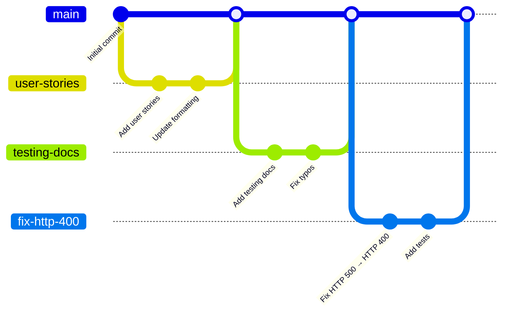

# Development Process

This document describes the team's development process, git workflow, issue management, quality gates, and testing strategy for the Avito Bonus Points Service.

---

## Overview

We follow a **Scrum-based process** with one-week Sprints. Each Sprint includes:

- **Sprint Planning** — define Sprint Goal and select PBIs
- **Daily Scrum** — 15-minute sync to discuss progress and blockers
- **Development work** — issue-linked branches and PRs
- **Sprint Review** — demonstrate increment to the customer
- **Sprint Retrospective** — reflect and improve the process

---

## Git Workflow

We use a **feature-branch workflow**:

- **Main branch** (`main`) is protected. Direct pushes are disabled.
- **Feature branches** are created from Issues: `<issue-number>-short-description`
- **Pull Requests** are required for all changes.
- **Review** by another team member is required before merge.

---

### Git Graph


---
### Explanation

The GitGraph diagram illustrates our **standard feature-branch workflow**. It shows the general development pattern we follow for every change, using three simplified examples:

1. `user-stories` — adding user stories documentation
2. `testing-docs` — creating testing documentation
3. `fix-http-400` — fixing HTTP error handling

In practice, every new task (whether a feature, bug fix, or documentation update) follows the same process:

- A new branch is created from `main` for each issue.
- The branch name follows the pattern `<issue-number>-short-description>`.
- Work is committed to that branch.
- Once ready, a Pull Request is opened and linked to the issue.
- After review and CI checks pass, the branch is merged back into `main` using a merge commit.

The diagram is not a historical log of all branches — it is a **visual representation of the workflow** that applies to every change in the project.

---

### Issue Workflow

We use GitHub Issues to track all work.

**Issue Types:**

- **User Story** — user-facing functionality
- **Other PBI** — technical tasks, infrastructure, documentation
- **Bug Report** — defects found during testing
- **Course Task** — assignment-related work (not PBIs)

**Each Issue must contain:**

- Clear title and description
- Acceptance criteria
- Story Points
- Assignee (implementer)
- Different reviewer
- Work Status (`To Do` → `Ready` → `In Progress` → `Review` → `Done`)

---

### Definition of Done

See [`docs/definition-of-done.md`](https://github.com/gosha185/SWP-Avito-project/blob/main/docs/definition-of-done.md) for the full checklist.

A PBI is Done when:

- All acceptance criteria are satisfied
- Code is reviewed by another team member
- PR is merged into `main`
- CI checks pass
- `CHANGELOG.md` is updated
- Quality requirements and QRTs are satisfied

---

## Code Review Process

Every change to the project is developed in a separate feature branch and integrated into the protected `main` branch through a GitHub Pull Request. Direct pushes to `main` are disabled to ensure that all changes are reviewed and verified before becoming part of the production codebase.

The review process follows these steps:

1. A developer creates a branch from the corresponding GitHub Issue using the naming convention `<issue-number>-short-description`.
2. The implementation is completed together with any required tests and documentation updates.
3. A Pull Request is opened and linked to the related issue.
4. GitHub Actions automatically executes the CI pipeline.
5. Another team member reviews the Pull Request.
6. After the CI pipeline succeeds and at least one approval is received, the Pull Request is merged using the **Merge Commit** strategy.

The reviewer verifies several aspects of every change:

* implementation satisfies the Issue acceptance criteria;
* code follows the team's coding style and formatting conventions;
* architectural decisions remain consistent with the existing design;
* appropriate unit, integration, or quality requirement tests are included or updated;
* no secrets, credentials, or sensitive information are committed;
* documentation and `CHANGELOG.md` are updated when required.

The project follows the repository requirements established for the course:

* all changes, including documentation and configuration updates, are submitted through Pull Requests;
* Pull Request authors cannot approve their own changes;
* at least one approval from another team member is required before merging;
* Pull Requests are merged only after all required CI checks have passed successfully;
* Merge Commit is used as the merge strategy to preserve complete development history and traceability between Issues, Pull Requests, and releases.

This workflow improves code quality, knowledge sharing within the team, and reduces the risk of introducing regressions into the protected branch.

---

## Database and Migrations

The project uses **PostgreSQL** as its primary relational database. Database access is implemented using Go's standard `database/sql` package together with the `sqlx` library and the `lib/pq` PostgreSQL driver. The project intentionally uses raw SQL instead of an ORM to provide explicit control over database queries and schema evolution.

Database schema changes are managed using **golang-migrate**, which provides versioned, repeatable, and reversible migrations. Migration files are stored in the repository under the `migrations/` directory.

Each migration consists of two files:

* `<version>_<description>.up.sql` — applies schema changes;
* `<version>_<description>.down.sql` — reverts the corresponding changes.

This approach guarantees that every schema modification can be reproduced consistently across all development environments while also allowing safe rollback when necessary.

During local development, migrations are applied manually using the `golang-migrate` CLI:

```bash
migrate -path ./migrations -database "$DB_DSN" up
```

A rollback can be performed with:

```bash
migrate -path ./migrations -database "$DB_DSN" down 1
```

When the project is started with Docker Compose, SQL migration scripts are mounted into PostgreSQL's `/docker-entrypoint-initdb.d/` directory. This allows the database schema to be initialized automatically during the first creation of the database volume. Existing databases are not modified automatically, ensuring predictable schema management after the initial deployment.

The CI pipeline validates that migrations are syntactically correct and can be executed successfully, although migrations are not applied automatically to shared environments. Schema updates remain an explicit deployment step to avoid unintended database modifications.

The project does not use seed data. Instead, all business data is created through the application's API during normal operation or automated tests. This keeps the database state reproducible while avoiding discrepancies between predefined seed data and real application behavior.

Overall, the migration strategy provides:

* version-controlled database schema evolution;
* reproducible environment setup;
* safe rollback using paired migration files;
* clear separation between schema management and application logic;
* consistent database initialization across local development and containerized deployments.

---

## CI and Quality Gates

The project utilizes **GitHub Actions** to automate code verification and enforce quality standards on every change. The CI pipeline is triggered automatically on pushes to the `main` branch, as well as on all Pull Requests targeting `main`.

The following quality gates are executed as part of the CI workflow:

* **Build Verification**: The pipeline ensures that the application compiles successfully without errors before any tests are run.
* **Automated Testing**: Unit, integration, and performance tests are executed automatically to catch regressions early in the development cycle.
* **Coverage Reporting**: Test coverage is measured during the CI run. HTML coverage reports are generated and uploaded as artifacts, allowing the team to review which parts of the code are exercised by tests.
* **Vulnerability Scanning**: The `govulncheck` tool is used to scan the codebase and its dependencies for known security vulnerabilities. This check runs on Pull Requests, pushes to `main`, and on a weekly schedule to ensure ongoing security.
* **Documentation Link Checking**: A Lychee-based workflow automatically verifies that all links in Markdown documentation files are valid, preventing broken references in the project docs.

These gates ensure that no code is merged into the protected `main` branch unless it passes all required automated checks, maintaining the stability, security, and quality of the project.

---

## Testing Strategy

The project follows a comprehensive testing strategy to ensure the reliability, correctness, and performance of the bonus service. Tests are organized into different levels based on their scope and purpose:

* **Unit and Integration Tests**: Unit tests verify the logic of individual components and functions in isolation. Integration tests validate the interaction between different parts of the system, particularly the database layer. To support this, the CI pipeline provisions a temporary PostgreSQL service container to run these tests against a real database instance, ensuring that SQL queries and schema interactions work as expected. They are located within the `internal/storage` packages and can be executed locally using:
  ```bash
  go test ./internal/storage/ -v
  ```
* **Test Coverage**: The CI pipeline automatically generates coverage profiles (coverage.out) and HTML reports. This allows the team to track how much of the codebase is covered by tests and identify areas that require additional test cases.
  
By combining unit and integration testing, the team ensures that changes are thoroughly validated at multiple levels before they reach the production environment.

---

## CI/CD and Deployment

The project uses a container-based deployment model with Docker and a CI-driven release workflow based on GitHub Actions.

### Continuous Integration

Every change merged into the `main` branch triggers the CI pipeline. The pipeline ensures that the application is always in a deployable state by executing:

- building the Go application inside a reproducible environment
- running unit, integration, and quality requirement tests
- executing static analysis and vulnerability checks
- validating that the application can be successfully containerized

Only changes that pass all CI checks are considered eligible for deployment.

---

### Deployment Strategy

The service is deployed using Docker Compose. The runtime environment includes:

- Go API service
- PostgreSQL database
- supporting infrastructure services (e.g. Swagger UI)

Deployment is performed by rebuilding containers from the latest version of the `main` branch:

```bash
docker compose up --build -d
```

This ensures that the deployed system always reflects the latest validated state of the repository.

---

### Release Process

Each merge into the `main` branch represents a new deployable version of the system.

- Releases are defined implicitly through Git history
- Rollback is performed by reverting to a previous commit and redeploying
- No manual changes are performed inside running containers

---

### Environment Configuration

All configuration is provided through a `.env` file. The CI pipeline assumes all required variables are present before deployment.

Required variables include:

- POSTGRES_USER
- POSTGRES_PASSWORD
- POSTGRES_DB
- DB_DSN

Missing or invalid configuration will prevent service startup, ensuring fail-fast behavior.

---

### Deployment Principles

- reproducible builds using Docker
- infrastructure defined as code via docker-compose
- CI must pass before deployment
- main branch is always deployable
- no manual production changes
