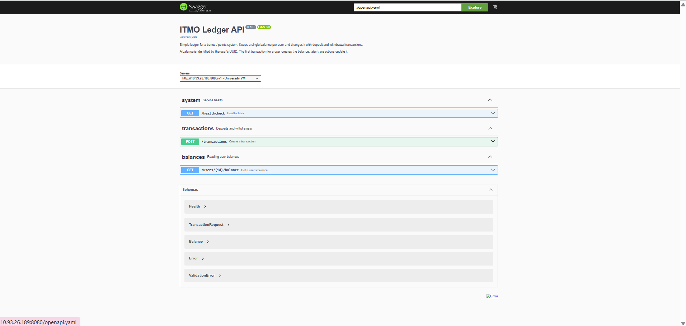
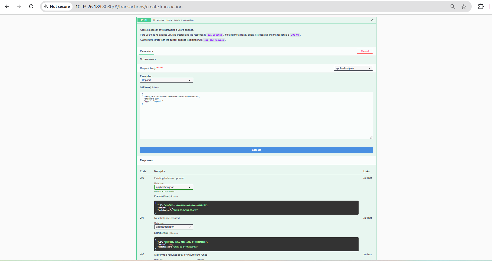
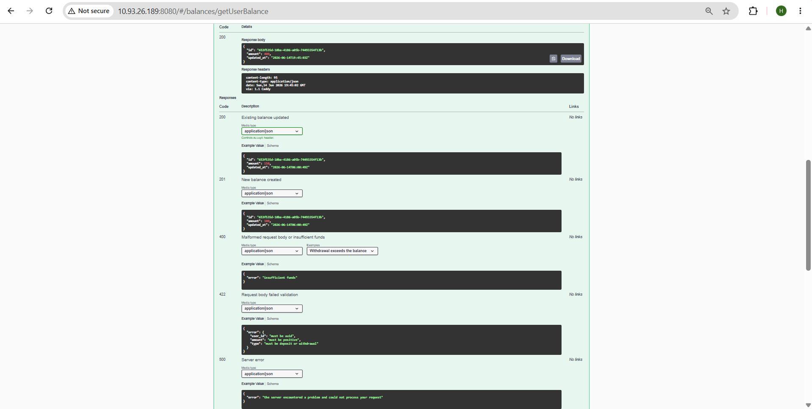
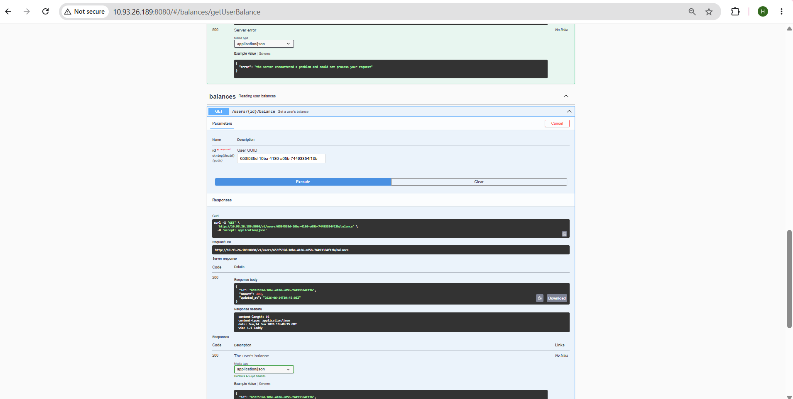
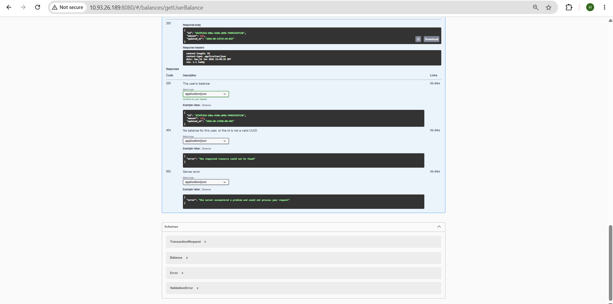
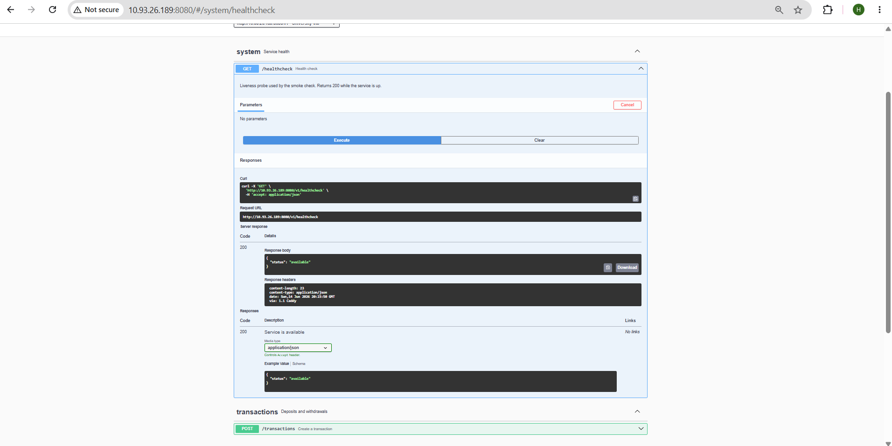
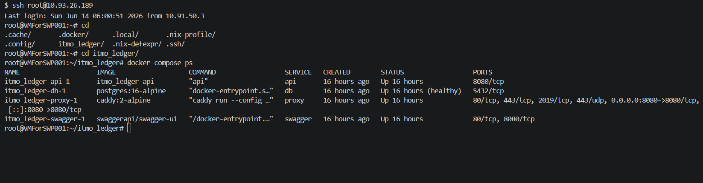
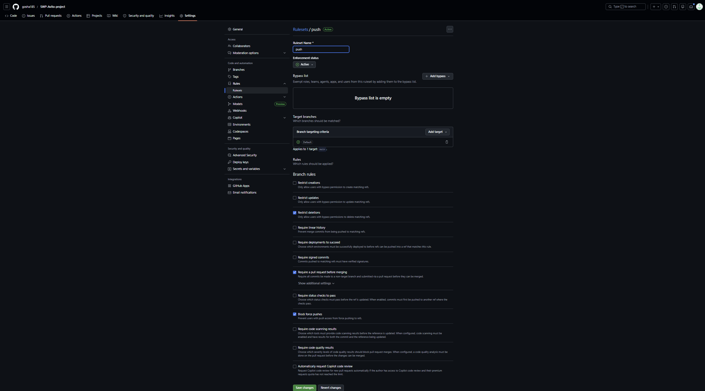

## Screenshots

### Selected prototype and interface artifacts

### Deployed MVP v0

### Protected default branch

### Reviewed pull request
<!-- TODO: add images/pr-review.png after a teammate approves this PR -->
