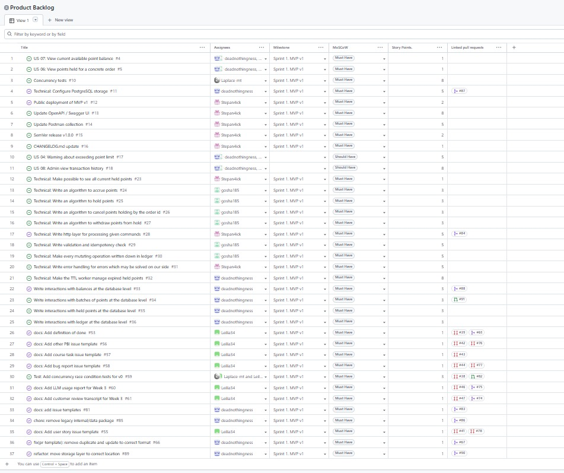
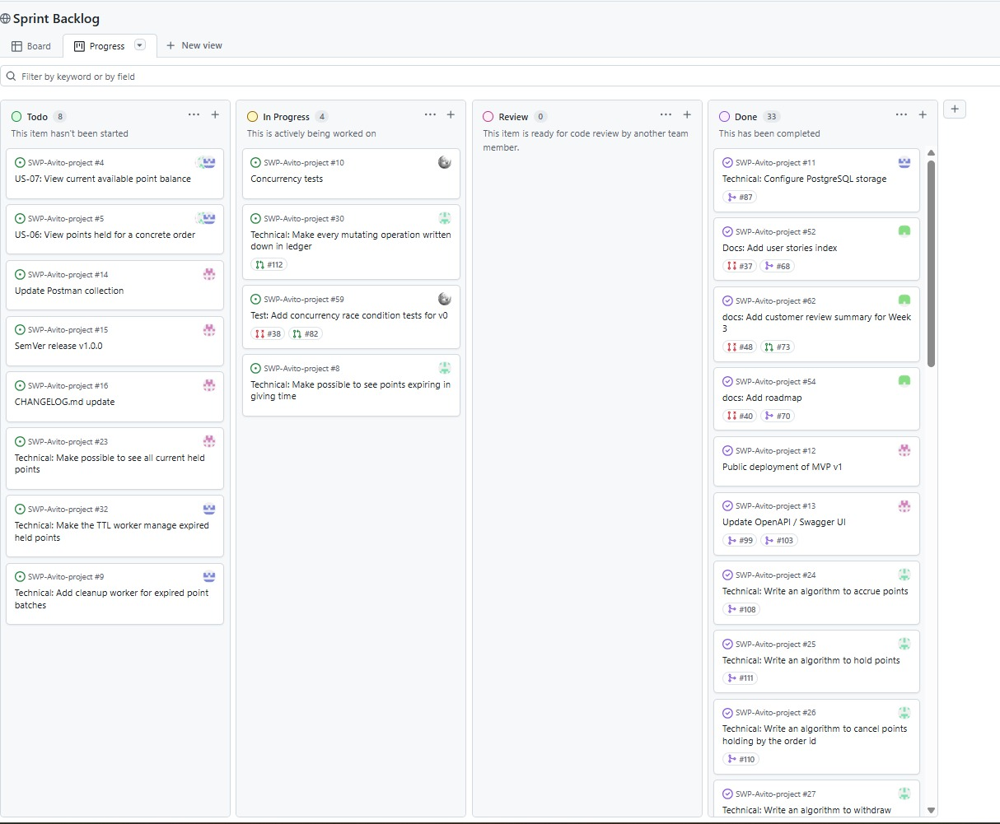
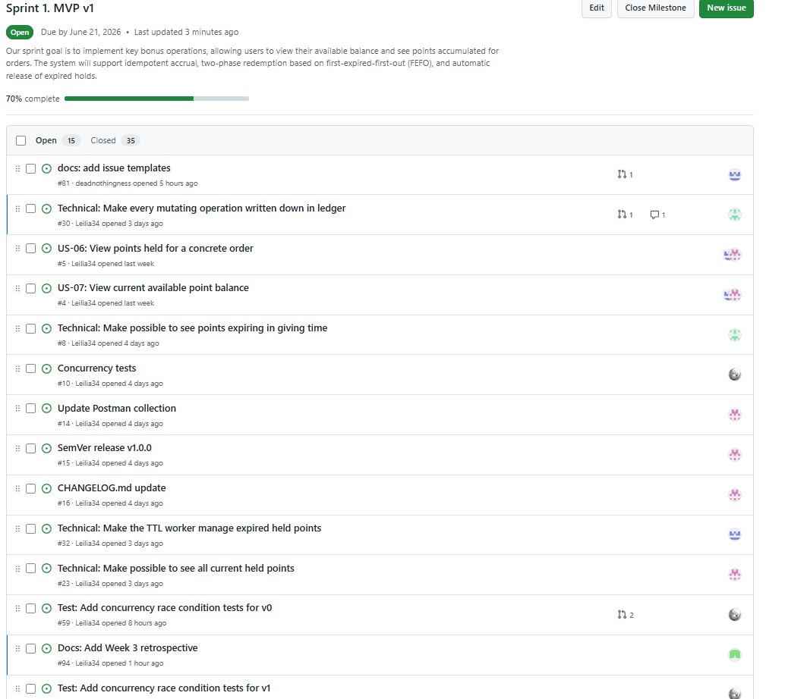
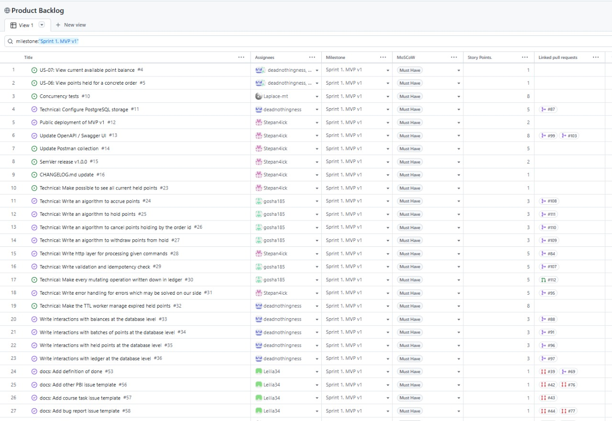
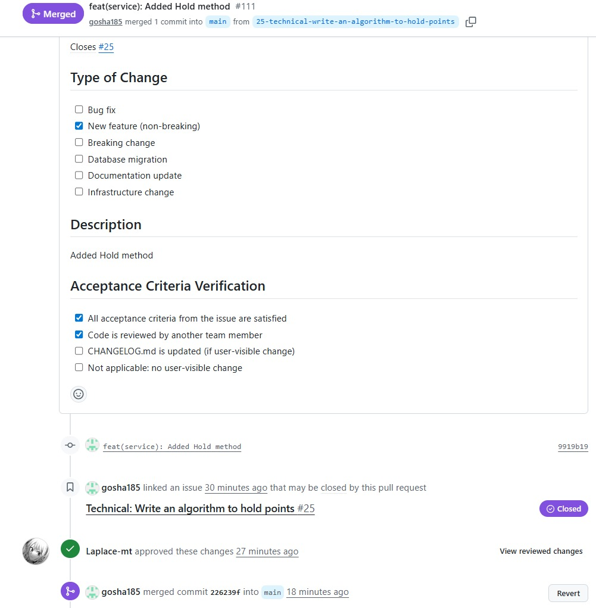

# Week 3 Report – MVP v1

## Project
[SWP-Avito-project](https://github.com/gosha185/SWP-Avito-project) – Bonus System

**License:** [MIT](https://github.com/gosha185/SWP-Avito-project/blob/65-week3-report-index/LICENSE)

---

## Artifacts

### Historical
- [User Stories (Assignment 2)](https://github.com/gosha185/SWP-Avito-project/blob/main/reports/week2/user-stories.md)

### Current
- [User Stories Index](https://github.com/gosha185/SWP-Avito-project/blob/main/docs/user-stories.md)
- [Sprint Report](https://github.com/gosha185/SWP-Avito-project/blob/main/reports/week3/sprint-report.md)
- [Definition of Done](https://github.com/gosha185/SWP-Avito-project/blob/main/docs/definition-of-done.md)
- [Roadmap](https://github.com/gosha185/SWP-Avito-project/blob/main/docs/roadmap.md)
- [Process Requirements](https://github.com/gosha185/SWP-Avito-project/blob/main/Process_Requirements.md)

### Backlogs
- [Product Backlog](https://github.com/users/gosha185/projects/1) 
- [Sprint Backlog](https://github.com/users/gosha185/projects/2) 

### Sprint
- [Sprint Milestone](https://github.com/gosha185/SWP-Avito-project/milestone/1)
- [MVP v1 Scope](https://github.com/gosha185/SWP-Avito-project/issues?q=is%3Aopen+is%3Aissue+milestone%3A%22Sprint+1.+MVP+v1%22)
- [CHANGELOG.md](https://github.com/gosha185/SWP-Avito-project/blob/main/CHANGELOG.md)

### Templates
- [Issue Templates](https://github.com/gosha185/SWP-Avito-project/tree/main/.github/ISSUE_TEMPLATE)
- [PR Template](https://github.com/gosha185/SWP-Avito-project/blob/main/.github/pull_request_template.md)

### Pull Requests

Each team member participated in the review workflow:

- [PR #80 – Week 3 report index](https://github.com/gosha185/SWP-Avito-project/pull/80) (created by Leilia and reviewed by Ivan)
- [PR #67 – remove duplicate and update to correct format](https://github.com/gosha185/SWP-Avito-project/pull/67) (created by Ekaterina, reviewed by Georgii)
- [PR #99 – add OpenAPI spec and Swagger UI for all endpoints](https://github.com/gosha185/SWP-Avito-project/pull/99) (created by Stepan, reviewed by Ekaterina)
- [PR #1 – Accrue points algorithm](https://github.com/gosha185/SWP-Avito-project/pull/1) (created by Georgii, reviewed by Stepan)
- [PR #82 – Concurrency tests](https://github.com/gosha185/SWP-Avito-project/pull/82) (created by Ivan, reviewed by Leilia)

### MVP v1 Delivery
- [Deployment URL](http://10.93.26.189:8080/) 
- [Smoke Check Video](https://drive.google.com/drive/folders/1TfXaxg2H7Fxpvp4eFZiBwjoB8QnFaAOz) 

---

## Screenshots

### Product Backlog

### Sprint Backlog

### Sprint Milestone

### MVP v1 Scope (Milestone filter)

### SemVer Release

### Delivered MVP v1

### Reviewed PR

---
## Customer Review
- [Transcript](https://github.com/gosha185/SWP-Avito-project/blob/main/reports/week3/customer-review-transcript.md) (sanitized, published with permission)
- [Summary](https://github.com/gosha185/SWP-Avito-project/blob/main/reports/week2/customer-meeting-summary.md)

---

## Team Retrospective
- [Reflection](https://github.com/gosha185/SWP-Avito-project/blob/main/reports/week3/reflection.md)
- [Retrospective](https://github.com/gosha185/SWP-Avito-project/blob/main/reports/week3/retrospective.md)
- [LLM Report](https://github.com/gosha185/SWP-Avito-project/blob/main/reports/week3/llm-report.md)
