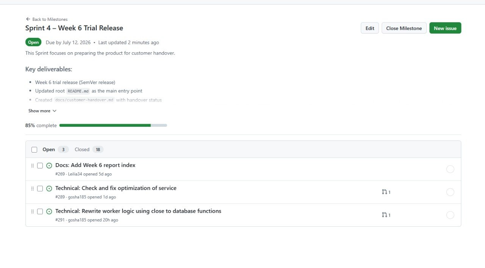
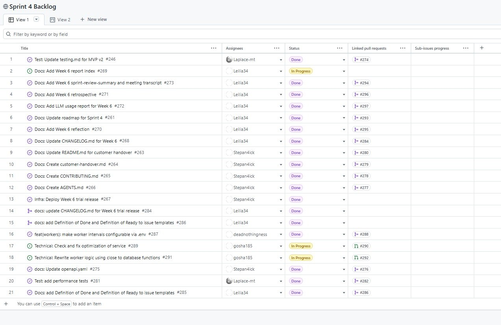
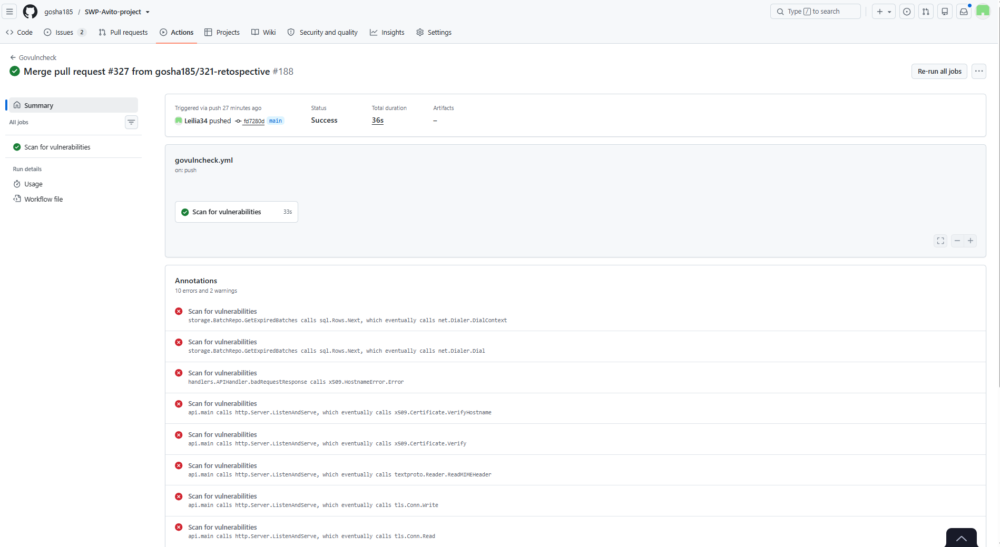
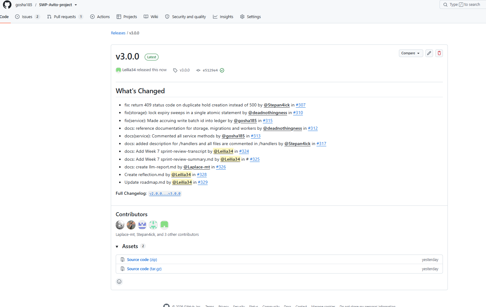
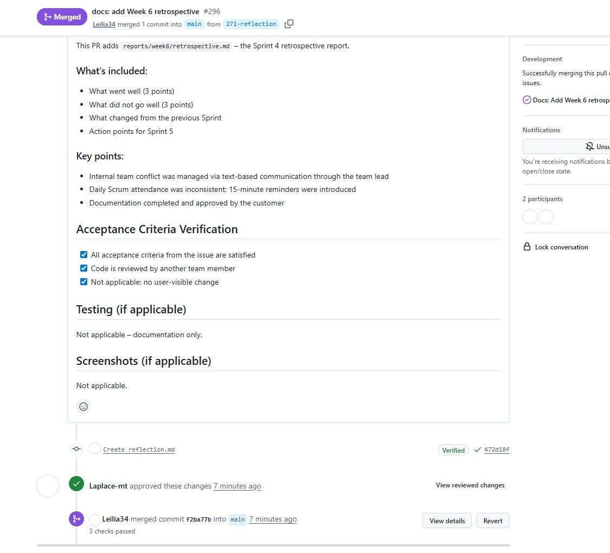
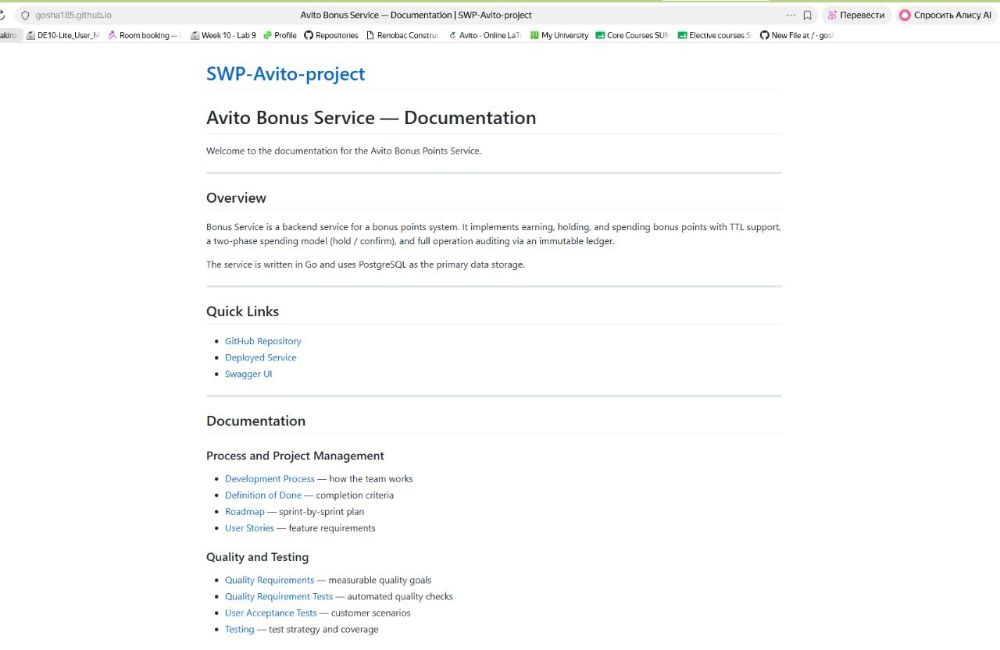
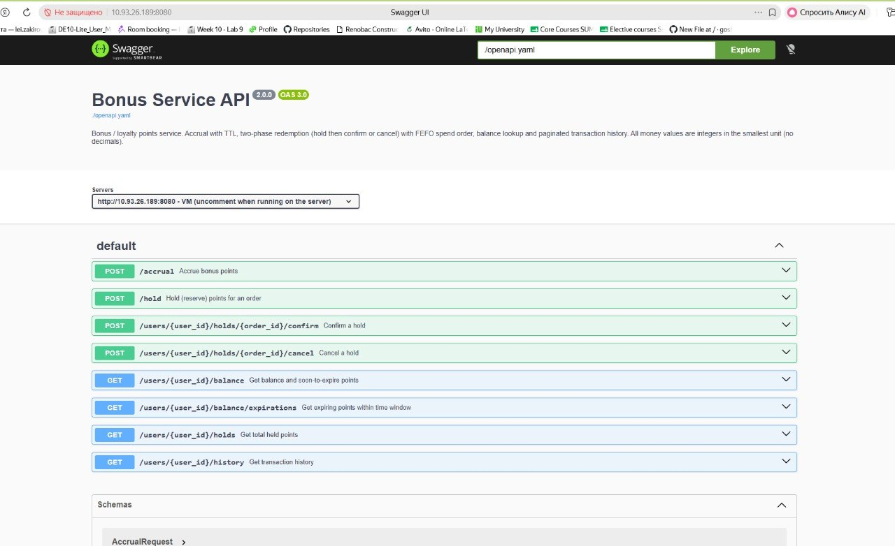

# Week 7 Report – MVP v3 (Final Delivery)

## Project
[SWP-Avito-project](https://github.com/gosha185/SWP-Avito-project) – Bonus System

**License:** [MIT](https://github.com/gosha185/SWP-Avito-project/blob/main/LICENSE)

---

## Sprint Overview

### Sprint Goal

**Address trial feedback, complete final transition, deliver MVP v3, and prepare for Demo Day.**

### Sprint Dates

13–19 July 2026

### Sprint Milestone

[Sprint 5 – MVP v3](https://github.com/gosha185/SWP-Avito-project/milestone/5)

---

## Artifacts

### Backlogs
- [Product Backlog](https://github.com/users/gosha185/projects/1)
- [Sprint 5 Backlog](https://github.com/users/gosha185/projects/5)

### Sprint
- [MVP v3 Scope](https://github.com/gosha185/SWP-Avito-project/issues?q=is%3Aopen+is%3Aissue+milestone%3A%22Sprint+5+–+MVP+v3%22)

---

## Quality Documentation

- [Quality Requirements](https://github.com/gosha185/SWP-Avito-project/blob/49a0025484e5e18f0c0d0464a73c7ffdbf6b5c25/docs/quality-requirements.md)
- [Quality Requirement Tests](https://github.com/gosha185/SWP-Avito-project/blob/49a0025484e5e18f0c0d0464a73c7ffdbf6b5c25/docs/quality-requirement-tests.md)
- [Testing Documentation](https://github.com/gosha185/SWP-Avito-project/blob/49a0025484e5e18f0c0d0464a73c7ffdbf6b5c25/docs/testing.md)
- [User Acceptance Tests](https://github.com/gosha185/SWP-Avito-project/blob/49a0025484e5e18f0c0d0464a73c7ffdbf6b5c25/docs/user-acceptance-tests.md)

---

## Architecture Documentation

- [Architecture README](https://github.com/gosha185/SWP-Avito-project/blob/49a0025484e5e18f0c0d0464a73c7ffdbf6b5c25/docs/architecture/README.md)
- [Static View](https://github.com/gosha185/SWP-Avito-project/tree/49a0025484e5e18f0c0d0464a73c7ffdbf6b5c25/docs/architecture/static-view)
- [Dynamic View](https://github.com/gosha185/SWP-Avito-project/tree/49a0025484e5e18f0c0d0464a73c7ffdbf6b5c25/docs/architecture/dynamic-view)
- [Deployment View](https://github.com/gosha185/SWP-Avito-project/tree/49a0025484e5e18f0c0d0464a73c7ffdbf6b5c25/docs/architecture/deployment-view)
- [ADRs](https://github.com/gosha185/SWP-Avito-project/tree/49a0025484e5e18f0c0d0464a73c7ffdbf6b5c25/docs/architecture/adr)

---

## Process Documentation

- [Development Process](https://github.com/gosha185/SWP-Avito-project/blob/49a0025484e5e18f0c0d0464a73c7ffdbf6b5c25/docs/development-process.md)
- [Definition of Done](https://github.com/gosha185/SWP-Avito-project/blob/49a0025484e5e18f0c0d0464a73c7ffdbf6b5c25/docs/definition-of-done.md)
- [Roadmap](https://github.com/gosha185/SWP-Avito-project/blob/49a0025484e5e18f0c0d0464a73c7ffdbf6b5c25/docs/roadmap.md)
- [Process Requirements](https://github.com/gosha185/SWP-Avito-project/blob/49a0025484e5e18f0c0d0464a73c7ffdbf6b5c25/Process_Requirements.md)
- [CONTRIBUTING.md](https://github.com/gosha185/SWP-Avito-project/blob/49a0025484e5e18f0c0d0464a73c7ffdbf6b5c25/CONTRIBUTING.md)
- [AGENTS.md](https://github.com/gosha185/SWP-Avito-project/blob/49a0025484e5e18f0c0d0464a73c7ffdbf6b5c25/AGENTS.md)

---

## Customer-Facing Documentation

- [README.md](https://github.com/gosha185/SWP-Avito-project/blob/49a0025484e5e18f0c0d0464a73c7ffdbf6b5c25/README.md)
- [Customer Handover](https://github.com/gosha185/SWP-Avito-project/blob/49a0025484e5e18f0c0d0464a73c7ffdbf6b5c25/docs/customer-handover.md)
- [Hosted Documentation Site](https://gosha185.github.io/SWP-Avito-project/)

---

## Deployment and Release

- [Deployment URL](http://10.93.26.189:8080/)
- [SemVer Release v3.0.0 (MVP v3)](https://github.com/gosha185/SWP-Avito-project/releases/tag/v3.0.0)
- [CHANGELOG.md](https://github.com/gosha185/SWP-Avito-project/blob/49a0025484e5e18f0c0d0464a73c7ffdbf6b5c25/CHANGELOG.md)
- [Public Demo Video](https://drive.google.com/drive/folders/1ErYiGQRrbtJMk0coST_A4IIJJGk0-AWv)

---

## CI and Quality Gates

- [CI Pipeline](https://github.com/gosha185/SWP-Avito-project/actions)
- [Latest CI Run](https://github.com/gosha185/SWP-Avito-project/actions/runs/29649096319)

---

## Customer Feedback Response

| Feedback point | Resulting PBI | Status | Response |
|---|---|---|---|
| Cancel hold should return HTTP 400, not HTTP 500 | [#177](https://github.com/gosha185/SWP-Avito-project/issues/177) | Done | Fixed in Sprint 3 |
| FEFO should be verified | — | Done | Verified — works correctly |
| Architecture should be documented | — | Done | ADRs created |
| Add DoD/DoR checklists to Issue templates | — | Done | Added to all templates |
| Idempotency: return 200 on retry with same key | — | Done | Fixed in Sprint 5 |

---

## Handover Status

| Field | Value |
|-------|-------|
| **Handover level reached** | `Ready for independent use` |
| **Customer confirmation status** | `Accepted` |
| **Date of confirmation** | 17 July 2026 |

---

## Current Product Status

### Completed
- ✅ MVP v1 (Sprint 1)
- ✅ Quality and Testing (Sprint 2)
- ✅ MVP v2 (Sprint 3)
- ✅ Trial Release and Handover Preparation (Sprint 4)
- ✅ MVP v3 – Final Delivery (Sprint 5)
- ✅ All UAT scenarios passed (10/10)
- ✅ Customer confirmed `Ready for independent use`
- ✅ Final SemVer release v3.0.0 created

---

## Next Steps

- Demo Day presentation (22 July 2026)
- Final course submission

---

## Contribution Traceability

| Team Member | Issues | PRs | Reviews | Testing/QA | Documentation |
|---|---|---|---|---|---|
| Leilia (Leilia34) | #201, #262, #324, #325, #328, #329 | ✅ | ✅ | — | ✅ |
| Stepan (Stepan4ick) | #307, #317 | ✅ | ✅ | — | — |
| Ekaterina (deadnothingness) | #310, #312 | ✅ | ✅ | — | ✅ |
| Georgii (gosha185) | #313, #315 | ✅ | ✅ | — | — |
| Ivan (Laplace-mt) | #326 | ✅ | ✅ | ✅ | — |

---

## Week 7 Files

- [Sprint Review Transcript](sprint-review-transcript.md)
- [Sprint Review Summary](sprint-review-summary.md)
- [Reflection](reflection.md)
- [Retrospective](retrospective.md)
- [LLM Report](llm-report.md)

---

## Screenshots

